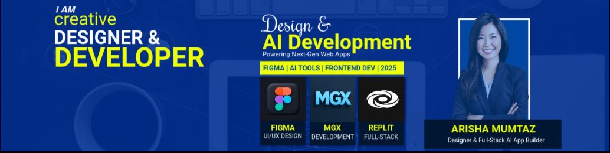

<!-- Banner -->

  

<h1 align="center">Hi 👋, I'm Arisha Mumtaz</h1>
<h3 align="center"> SQA | UI/UX Designer </h3>

<!-- Typing Animation -->

  

##  About Me  
-  Currently working on **SQA TESTING + UI/UX Projects**  
-  Designing **responsive websites, UI/UX mockups, T-shirt graphics, and product branding**  
-  Developing **dynamic websites using PHP, Java , HTML, CSS, JS**  
-  Learning: **SQA techniques (manual + automation) testing**  
-  Contact: **arishamumtaz340@gmail.com**  
-  Portfolio:  
  - Web Dev → [arishadev.xyz](https://arishadev.netlify.app/)  
  - Design → [arishas-portfolio](https://arishas-portfolio-6a869d.webflow.io)  
-  LinkedIn → [arisha-mumtaz](https://www.linkedin.com/in/arisha-mumtaz/)

---

##  Connect with Me

  
  

---

##  Languages & Tools

  

---

## GitHub Stats

  
  

---

##  Fun Fact  
I love turning *simple ideas* into **beautiful, functional, and user-friendly digital experiences.**

---

###  Thank you for Visiting My Profile!
